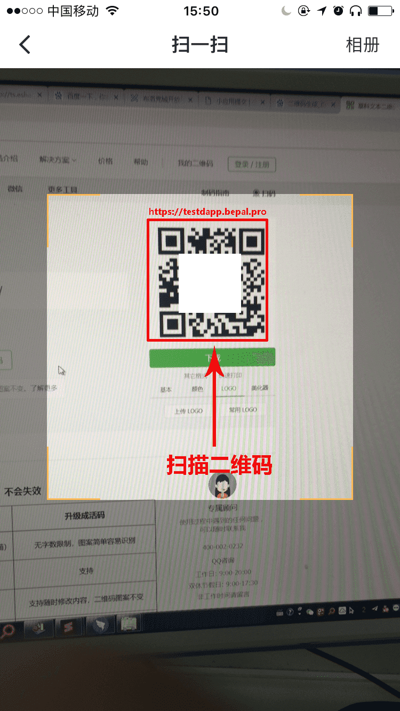

# 接入前准备

1. 开发者模式开启后才可以添加外部DAPP。
2. DAPP超链接应当使用 **https**

- [下载BEPAL Wallet](#下载BEPAL Wallet)
- [开启开发者模式](#开启开发者模式)
- [添加外部DAPP](#添加外部DAPP)
- [引用](#引用)

# 下载BEPAL Wallet

# 开启开发者模式

# 添加外部DAPP

# 引用

扫描二维码，添加测试用例。

